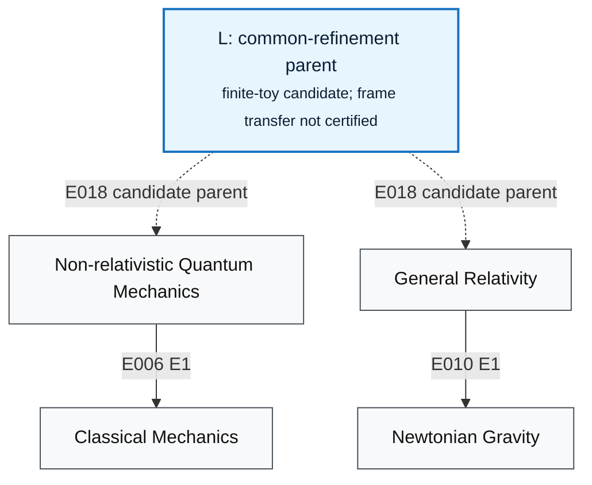

# Physics Layer Atlas Theory Map

Generated by [`physics_atlas/generate_theory_map.py`](generate_theory_map.py) from:

- `physics_atlas/phase3/scored_run/theory_manifest.jsonl`
- `physics_atlas/phase3/scored_run/edge_manifest.jsonl`
- cross-check table in `physics_atlas/phase3/PHASE3_ATLAS.md`

## Reading Guide

Arrow convention: every arrow points from the richer or more-fundamental layer to its shadow, readout, or coarser layer. Manifest `down` edges keep their source-to-target direction. Manifest `up` edges are reoriented as target-to-source when they are included in the directed backbone.

Critical QM/GR rule: `quantum_mechanics` and `general_relativity` are siblings under the constructed finite-toy parent `L_qm_gr`. There is no direct QM-to-GR or GR-to-QM reduction arrow in this map.

E3 cards are not inserted into the reduction backbone as theory layers. They are rendered as foreclosure nodes attached to the relevant manifest theory-card endpoint. For cards whose other endpoint is not a theory-manifest node, such as E037, the attachment uses the manifest theory-card endpoint and the source/provenance remains in the omitted-edge ledger.

Styles:

- Solid arrow: E0/E1 established shadow relation.
- Dashed arrow: E2 recognition/import relation or a finite-toy candidate-layer response.
- Thick red arrow: E3 foreclosure/open hole.
- Blue nodes: constructed finite-toy missing layers.
- Yellow foreclosure nodes: still open here.

## Master Mermaid Map

```mermaid
flowchart TB
  Title["Physics Layer Atlas<br/><small>Arrows point richer layer -> shadow/readout</small>"]

  subgraph Quantum___Particle[Quantum / Particle]
    standard_model["The Standard Model of Particle Physics<br/><small>standard_model</small>"]
    electroweak_theory["Electroweak (Glashow-Salam-Weinberg) Theory<br/><small>electroweak_theory</small>"]
    qcd["Quantum Chromodynamics<br/><small>qcd</small>"]
    qed["Quantum Electrodynamics<br/><small>qed</small>"]
    relativistic_qft["Relativistic Quantum Field Theory (general framework)<br/><small>relativistic_qft</small>"]
    rg_eft["Renormalization Group / Effective Field Theory (as a layer-generating principle)<br/><small>rg_eft</small>"]
    quantum_mechanics["Non-relativistic Quantum Mechanics<br/><small>quantum_mechanics</small>"]
    condensed_matter_spt["Condensed Matter / Symmetry-Protected Topological Phases<br/><small>condensed_matter_spt</small>"]
  end

  subgraph Gravity___Cosmology[Gravity / Cosmology]
    general_relativity["General Relativity<br/><small>general_relativity</small>"]
    newtonian_gravity["Newtonian Gravity<br/><small>newtonian_gravity</small>"]
    lambda_cdm["Lambda-CDM Cosmology<br/><small>lambda_cdm</small>"]
    black_hole_thermodynamics["Black-Hole Thermodynamics<br/><small>black_hole_thermodynamics</small>"]
  end

  subgraph Statistical___Continuum[Statistical / Continuum]
    statistical_mechanics["Statistical Mechanics<br/><small>statistical_mechanics</small>"]
    thermodynamics["Classical Thermodynamics<br/><small>thermodynamics</small>"]
    kinetic_theory["Kinetic Theory (Boltzmann transport)<br/><small>kinetic_theory</small>"]
    hydrodynamics["Hydrodynamics / Navier-Stokes<br/><small>hydrodynamics</small>"]
    brownian_langevin["Brownian Motion / Langevin-Fokker-Planck Stochastic Dynamics<br/><small>brownian_langevin</small>"]
  end

  subgraph Classical_Limits[Classical Limits]
    special_relativity["Special Relativity<br/><small>special_relativity</small>"]
    classical_mechanics["Classical (Newtonian/Lagrangian/Hamiltonian) Mechanics<br/><small>classical_mechanics</small>"]
    classical_electromagnetism["Classical Electromagnetism (Maxwell)<br/><small>classical_electromagnetism</small>"]
    geometrical_optics["Geometrical (Ray) Optics<br/><small>geometrical_optics</small>"]
  end

  subgraph Built_Missing_Layers[Constructed / Candidate Missing Layers]
    L_qm_gr["L: QM-GR common-refinement parent<br/><small>E018 finite-toy candidate; frame transfer not certified</small>"]
    Lstar_sm["L*: SM selection/measure layer<br/><small>E009/E019/E020/E037/E043 finite toy v2</small>"]
    GR_upper["GR upper-boundary readouts<br/><small>E021/E042 finite toy</small>"]
  end

  subgraph Foreclosures[E3 Foreclosures / Open Holes]
    F_E009["E009: UV-completion fiber"]
    F_E019["E019: gauge-group origin"]
    F_E020["E020: fermion generations"]
    F_E021["E021: cosmological constant"]
    F_E032["E032: measurement outcome (open)"]
    F_E037["E037: vacuum selection"]
    F_E041["E041: confinement (open)"]
    F_E042["E042: singularity boundary"]
    F_E043["E043: electroweak hierarchy"]
  end

  subgraph Legend[Legend]
    LEG_SOLID["solid: established E0/E1 shadow"]
    LEG_DASH["dashed: E2 recognition/import or finite-toy candidate"]
    LEG_RED["thick red: E3 foreclosure/open hole"]
  end

  statistical_mechanics -->|E002 E1| thermodynamics
  special_relativity -->|E003 E1| classical_mechanics
  kinetic_theory -->|E004 E1| hydrodynamics
  general_relativity -.->|E005 E2| black_hole_thermodynamics
  quantum_mechanics -->|E006 E1| classical_mechanics
  relativistic_qft -->|E008 E1| rg_eft
  general_relativity -->|E010 E1| newtonian_gravity
  classical_electromagnetism -->|E011 E1| geometrical_optics
  qed -->|E012 E1| classical_electromagnetism
  statistical_mechanics -->|E013 E1| brownian_langevin
  relativistic_qft -->|E014 E1| quantum_mechanics
  electroweak_theory -->|E015 E1| qed
  general_relativity -.->|E022 E2| thermodynamics
  quantum_mechanics -.->|E025 E2| thermodynamics
  general_relativity -->|E028a E1| lambda_cdm
  classical_mechanics -.->|E033 E2| thermodynamics
  L_qm_gr -.->|E018 candidate parent| quantum_mechanics
  L_qm_gr -.->|E018 candidate parent| general_relativity
  rg_eft ==>|E009 E3| F_E009
  Lstar_sm -.->|finite-toy response| F_E009
  standard_model ==>|E019 E3| F_E019
  Lstar_sm -.->|finite-toy response| F_E019
  standard_model ==>|E020 E3| F_E020
  Lstar_sm -.->|finite-toy response| F_E020
  general_relativity ==>|E021 E3| F_E021
  GR_upper -.->|finite-toy response| F_E021
  quantum_mechanics ==>|E032 E3| F_E032
  standard_model ==>|E037 E3| F_E037
  Lstar_sm -.->|finite-toy response| F_E037
  qcd ==>|E041 E3| F_E041
  general_relativity ==>|E042 E3| F_E042
  GR_upper -.->|finite-toy response| F_E042
  electroweak_theory ==>|E043 E3| F_E043
  Lstar_sm -.->|finite-toy response| F_E043

  classDef theory fill:#f8f9fa,stroke:#495057,color:#111;
  classDef built fill:#e7f5ff,stroke:#1971c2,stroke-width:2px,color:#0b1f33;
  classDef foreclosure fill:#fff0f0,stroke:#c1121f,stroke-width:2px,color:#3b0000;
  classDef open fill:#fff3bf,stroke:#e67700,stroke-width:2px,color:#3b2500;
  classDef legend fill:#ffffff,stroke:#adb5bd,color:#111;
  class black_hole_thermodynamics,brownian_langevin,classical_electromagnetism,classical_mechanics,condensed_matter_spt,electroweak_theory,general_relativity,geometrical_optics,hydrodynamics,kinetic_theory,lambda_cdm,newtonian_gravity,qcd,qed,quantum_mechanics,relativistic_qft,rg_eft,special_relativity,standard_model,statistical_mechanics,thermodynamics theory;
  class L_qm_gr,Lstar_sm,GR_upper built;
  class F_E009,F_E019,F_E020,F_E021,F_E037,F_E042,F_E043 foreclosure;
  class F_E032,F_E041 open;
  class Title,LEG_SOLID,LEG_DASH,LEG_RED legend;
  linkStyle 3 stroke:#6c757d,stroke-dasharray:5 5;
  linkStyle 12 stroke:#6c757d,stroke-dasharray:5 5;
  linkStyle 13 stroke:#6c757d,stroke-dasharray:5 5;
  linkStyle 15 stroke:#6c757d,stroke-dasharray:5 5;
  linkStyle 16 stroke:#6c757d,stroke-dasharray:5 5;
  linkStyle 17 stroke:#6c757d,stroke-dasharray:5 5;
  linkStyle 18 stroke:#c1121f,stroke-width:3px;
  linkStyle 19 stroke:#6c757d,stroke-dasharray:5 5;
  linkStyle 20 stroke:#c1121f,stroke-width:3px;
  linkStyle 21 stroke:#6c757d,stroke-dasharray:5 5;
  linkStyle 22 stroke:#c1121f,stroke-width:3px;
  linkStyle 23 stroke:#6c757d,stroke-dasharray:5 5;
  linkStyle 24 stroke:#c1121f,stroke-width:3px;
  linkStyle 25 stroke:#6c757d,stroke-dasharray:5 5;
  linkStyle 26 stroke:#c1121f,stroke-width:3px;
  linkStyle 27 stroke:#c1121f,stroke-width:3px;
  linkStyle 28 stroke:#6c757d,stroke-dasharray:5 5;
  linkStyle 29 stroke:#c1121f,stroke-width:3px;
  linkStyle 30 stroke:#c1121f,stroke-width:3px;
  linkStyle 31 stroke:#6c757d,stroke-dasharray:5 5;
  linkStyle 32 stroke:#c1121f,stroke-width:3px;
  linkStyle 33 stroke:#6c757d,stroke-dasharray:5 5;
```

## Focused QM/GR Inset

## Constructed-Layer Sources

| Layer node | Source files |
| --- | --- |
| L_qm_gr | physics_atlas/thread_qm_gr/findings_qm_gr.md physics_atlas/thread_qm_gr/steps/step35_qgr_uniqueness_theorem_artifacts/T_QGR_Unique.tex |
| Lstar_sm | physics_atlas/thread_cluster_a/findings_cluster_a.md physics_atlas/thread_cluster_a/steps/step7_consolidated_statement_artifacts/cluster_a_consolidated_statement.tex |
| GR_upper | physics_atlas/thread_cluster_b/findings_cluster_b.md physics_atlas/thread_cluster_b/steps/step4_consolidated_statement_artifacts/cluster_b_consolidated_statement.tex |

## Backbone Edge Provenance

Every backbone edge below is generated from `edge_manifest.jsonl`; the last column checks the human-readable Phase 3 table.

| E | manifest source | manifest target | direction | tier | modality | emitted orientation | Phase3 table |
| --- | --- | --- | --- | --- | --- | --- | --- |
| E002 | statistical_mechanics | thermodynamics | down | E1 | shadow-down | statistical_mechanics -> thermodynamics | ok |
| E003 | special_relativity | classical_mechanics | down | E1 | shadow-down | special_relativity -> classical_mechanics | ok |
| E004 | kinetic_theory | hydrodynamics | down | E1 | shadow-down | kinetic_theory -> hydrodynamics | ok |
| E005 | general_relativity | black_hole_thermodynamics | down | E2 | currency-shadow-price | general_relativity -> black_hole_thermodynamics | ok |
| E006 | quantum_mechanics | classical_mechanics | down | E1 | shadow-down | quantum_mechanics -> classical_mechanics | ok |
| E008 | relativistic_qft | rg_eft | down | E1 | shadow-down | relativistic_qft -> rg_eft | ok |
| E010 | general_relativity | newtonian_gravity | down | E1 | shadow-down | general_relativity -> newtonian_gravity | ok |
| E011 | classical_electromagnetism | geometrical_optics | down | E1 | shadow-down | classical_electromagnetism -> geometrical_optics | ok |
| E012 | qed | classical_electromagnetism | down | E1 | shadow-down | qed -> classical_electromagnetism | ok |
| E013 | statistical_mechanics | brownian_langevin | down | E1 | shadow-down | statistical_mechanics -> brownian_langevin | ok |
| E014 | relativistic_qft | quantum_mechanics | down | E1 | shadow-down | relativistic_qft -> quantum_mechanics | ok |
| E015 | electroweak_theory | qed | down | E1 | shadow-down | electroweak_theory -> qed | ok |
| E022 | thermodynamics | general_relativity | up | E2 | recognition-landing | general_relativity -> thermodynamics | ok |
| E025 | quantum_mechanics | thermodynamics | down | E2 | recognition-landing | quantum_mechanics -> thermodynamics | ok |
| E028a | general_relativity | lambda_cdm | down | E1 | shadow-down | general_relativity -> lambda_cdm | ok |
| E033 | classical_mechanics | thermodynamics | down | E2 | recognition-landing | classical_mechanics -> thermodynamics | ok |

## Omitted Manifest Edges

The backbone is intentionally compact and acyclic. E3 foreclosures that matter for the constructed work are shown as foreclosure nodes. Minor phenomenon/candidate/readout edges are omitted below, with reasons.

| E | manifest relation | direction | tier | reason |
| --- | --- | --- | --- | --- |
| E001 | qcd -> hadron-spectrum | up | E0 | non-theory endpoint (theory_card->observable_readout); omitted for legibility |
| E007 | quantum_mechanics -> classical-probability | down | E2 | non-theory endpoint (theory_card->candidate_substructure); omitted for legibility |
| E016 | standard_model -> electroweak_theory | down | E3 | E3 theory-to-theory foreclosure/failed near-layer relation; not drawn as an established reduction backbone |
| E017 | standard_model -> qcd | down | E3 | E3 theory-to-theory foreclosure/failed near-layer relation; not drawn as an established reduction backbone |
| E023 | conformal-field-theory -> general_relativity | bidir | E2 | non-theory endpoint (candidate_substructure->theory_card); omitted for legibility |
| E024 | conformal-field-theory -> entanglement-geometry | bidir | E2 | non-theory endpoint (candidate_substructure->observable_readout); omitted for legibility |
| E026 | quantum_mechanics -> decoherence-pointer-basis | down | E2 | non-theory endpoint (theory_card->candidate_substructure); omitted for legibility |
| E027a | condensed_matter_spt -> spt-phases | up | E2 | non-theory endpoint (theory_card->observable_readout); omitted for legibility |
| E027b | condensed_matter_spt -> spt-phases | up | E0 | non-theory endpoint (theory_card->observable_readout); omitted for legibility |
| E028b | general_relativity -> lambda_cdm | up | E2 | recognition/import leg paired with E028a; omitted to avoid a visual cycle |
| E029 | qcd -> chiral-perturbation-theory | down | E2 | non-theory endpoint (theory_card->candidate_substructure); omitted for legibility |
| E030 | thermodynamics -> arrow-of-time | up | E2 | non-theory endpoint (theory_card->observable_readout); omitted for legibility |
| E031 | hydrodynamics -> turbulence | up | E0 | non-theory endpoint (theory_card->observable_readout); omitted for legibility |
| E034 | general_relativity -> quantum-field-theory-curved | down | E2 | non-theory endpoint (theory_card->candidate_substructure); omitted for legibility |
| E035a | lattice-gauge-theory -> qcd | down | E1 | non-theory endpoint (candidate_substructure->theory_card); omitted for legibility |
| E035b | lattice-gauge-theory -> qcd | up | E0 | non-theory endpoint (candidate_substructure->theory_card); omitted for legibility |
| E036 | quantum_mechanics -> berry-phase-holonomy | down | E1 | non-theory endpoint (theory_card->observable_readout); omitted for legibility |
| E038 | statistical_mechanics -> phase-transitions-universality | down | E1 | non-theory endpoint (theory_card->observable_readout); omitted for legibility |
| E039 | special_relativity -> classical_electromagnetism | bidir | E1 | bidirectional/common-refinement relation; omitted from directed acyclic backbone |
| E040 | many-body-quantum -> fermi-liquid-theory | down | E1 | non-theory endpoint (candidate_substructure->candidate_substructure); omitted for legibility |

## Self-Verification

| Check | Requirement | Result |
| --- | --- | --- |
| a | No direct quantum_mechanics <-> general_relativity edge anywhere | PASS |
| b | L_qm_gr -.-> quantum_mechanics and L_qm_gr -.-> general_relativity present | PASS |
| c | classical_mechanics has exactly two incoming E0/E1 reductions: E006 and E003 | PASS |
| d | general_relativity -> newtonian_gravity E010 present; GR shadows are not chained under QM | PASS |
| e | No directed cycle in emitted directed graph | PASS |
| f | Every backbone edge maps to a real manifest E-number | PASS |

## Generation Stats

- Theory nodes from manifest: `21`.
- Visible master-map nodes including built layers, foreclosures, title, and legend: `37`.
- Built/candidate layer nodes: `3`.
- Foreclosure/open-hole nodes rendered: `9`.
- Manifest backbone edges rendered: `16`.
- Constructed/candidate response edges rendered: `9`.
- All six required checks: `PASS`.
